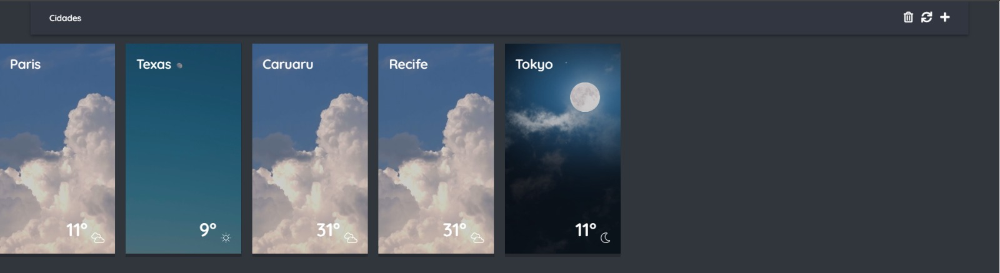
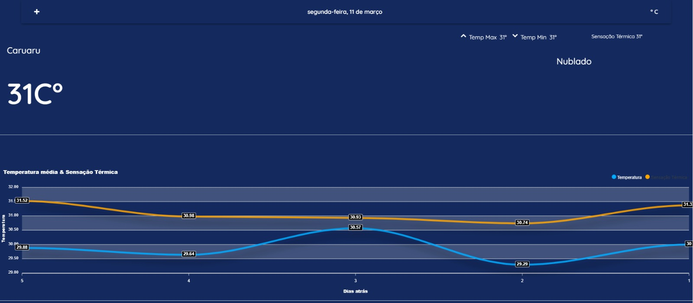

# weahterapp

## Descrição
Aplicação desenvolvida para obter dados dinâmicos da API do OpenWeatherMap, utilizando recursos do Firestore para armazenar as cidades cadastradas pelo usuário, assim como dados do tempo que são atualizados dinamicamente. Na tela inicial, possui cards com informações meteorológicas resumidas da cidade, assim como vídeos e ícones interativos baseados na temperatura, ventos e hora do dia. Site também conta com responsividade, mudando seu layout com base nos diferentes tamanhos de tela.




## Configuração
Para instalar as dependências da aplicação, execute o seguinte comando:
```
npm install
```
## Execução
Para rodar a aplicação, execute o seguinte comando:
```
npm run serve
```
## Tecnologias
### Tecnologias utilizadas na aplicação

-[x] Prettier
-[x] EsLint
-[x] Vuetify
-[x] ApexCharts
-[x] Jest
-[x] Typescript
-[x] Firebase/Firestore
-[x] Vue
-[x] Cypress(configs iniciais)